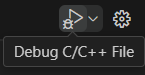
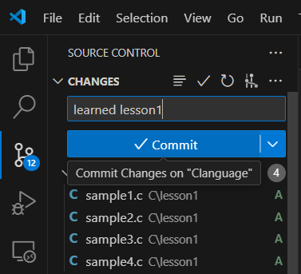
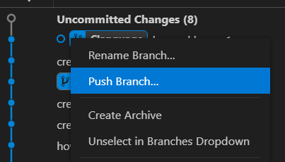

# 概要と目的
- プログラム言語について学ぶ
- C言語のプログラムの実行方法について学ぶ
- `printf()`の使い方について学ぶ

# 1-1.C言語とは
## (1) プログラミング言語とC言語
プログラミング言語とはコンピュータに指示を出すための言葉です。ある決まった文法規則にのっとり記述することで、コンピュータに指示を出すことができます。人間が話す言葉にも、英語や日本語など様々な文法があるように、プログラミング言語にも様々な文法が存在します。例えば、C言語やPython、JavaScript、C#などがあります。それぞれのプログラミング言語ごとに特徴が異なります。

この講義ではC言語を学習します。C言語の特徴は、シンプルで高速であるということです。C言語は昔から存在します。ここではC言語についてまだまだ話したい特徴がありますが、その前に一通りC言語について学習してしまいましょう！

この資料は[一週間で身につくC言語の基本](https://c-lang.sevendays-study.com/index.html)というWebサイトの一部抜粋と改変を加えた資料です。より詳しく学習したい方は、原本をご確認ください。

## (2) Hello,World
まずは一番基礎的で、かつ有名なプログラムを実行してみましょう！それはHello,Worldと呼ばれるプログラムです。

以下の`sample1.c`のプログラムを`lesson1/sample1.c`のファイルに記入しましょう。

```c
/* sample1.c */
#include <stdio.h>

int main(void){
    printf("Hello World.\n");
    return 0;
}
```

記入が終われば、`ctrl+s`でファイルを保存してください。プログラムを実行する場合は、右上の再生ボタンを押すことできます。



再生ボタンを押すことでターミナルが立ち上がり、プログラムが実行されます。ターミナルに`Hello World`と表示されれば成功です！

資料では`# 実行結果`とかかれた部分が、ターミナルの出力部分だと思ってください。

```sh
# 実行結果
Hello World.
```

# 1-2.プログラムの仕組み
では先ほどのプログラムはどのような仕組みになっているのでしょうか？1つずつ解説していきます。

## (1) 関数
```c
int main(void){
    printf("Hello World.\n");
    return 0;
}
```
3行目の`int main(…)`の部分ですが、ここはメイン関数の宣言と呼ばれます。

C言語は、このメイン関数の中に処理を書くことにより、実行されます。処理の中身は、"{"および"}"で囲まれています。この処理の中には、`printf`という命令があり、これは、コンソールに文字を出力するものなのです。こういった命令のことを、C言語では、正式に関数（かんすう）と呼びます。

関数には、もともとC言語に備わったものと、ユーザーによって後から付け足されるものがあります。`printf()`関数は、もともとC言語に備わっている関数のうちの一つです。`printf()`関数は、()内にあるものをコンソール画面に表示すると言う機能があります。

最後の「`return 0;`」はmain内の処理の終了を表します。

## (2) ヘッダファイル
```c
#include <stdio.h>
```
1行目に出てくる、`#include`という記述は、ヘッダファイルと呼ばれるファイルを読み込むときに用いる宣言です。ここで読み込むファイルは、`stdio.h`というファイルです。先ほど説明した、`printf()`関数を使用するために`stdio.h`というファイルを読み込んでいます。

## (3) セミコロン
最後に記述されている記号｢`;`｣は、セミコロンと言い、処理の末尾に記述するものです。現在、このプログラムには、1行の処理しかありませんが、複数行にわたる処理が記述される場合、必ずこのセミコロンによって、それぞれの処理を区切る必要があります。

## (4) エスケープシーケンス
また、この中にある｢`\n`｣は、改行を表す特殊な文字です。この文字があると、文字列はそこで改行され、続く文字は次の行から改行されます。この改行記号のように∖マーク(バックスラッシュ)で始まる文字を、エスケープシーケンスと言います。よく使うエスケープシーケンスを以下にまとめました。

| 記号 | 意味             |
| ---- | ---------------- |
| ∖n   | 改行             |
| ∖t   | タブ             |
| ∖0   | ヌル（null）文字 |

次のサンプルは、このエスケープシーケンスを用いたサンプルです。実行して結果をみてみましょう。

```c
/* sample2.c */
#include <stdio.h>

int main(void){
    printf("123\n456\n789\n");
    printf("1\t2\t3\t\n");
    printf("4\t5\t6\t\n");
    return 0;
}
```

# 1-3.色々表示してみよう
C言語の基本と、`printf()`関数の基本がわかったところで、この関数を利用して様々な処理を試してみましょう。

## (1) 書式指定
次に、以下のプログラムを実行してみてください。
```c
/* sample3.c */
#include <stdio.h>

int main(void){
	printf("私の名前は%sです。年齢は%d歳です。\n", "山田太郎", 20);
	printf("イニシャルは、%cです。\n", 'Y');
	printf("%lf + %lf = %lf\n", 1.2, 2.7, 1.2 + 2.7);
    return 0;
}
```

```sh
# 実行結果
こんにちは。私の名前は山田太郎です。年齢は20歳です。
イニシャルはYです。
1.200000 + 2.700000 = 3.900000
```

まずは5行目の`printf()`に注目してください。文字列の中に、`%s`や、`%d`や、といったような不思議な記号がついています。この部分は、後に","（コンマ）で区切った値を表示するのです。

例えば、5行目の`%s`には、山田太郎という文字列が、`%d`には、20という数値が入るという具合です。文字列の後にコンマで区切られた一つ、もしくは複数の値を入れるのですが、そこに並べたとおりにデータが表示されます。

この記号と書式の指定は、以下のようなに対応しています。

| 書式 | 意味               | 使用例                   |
| :--- | :----------------- | :----------------------- |
| %d   | 整数値を表示する。 | 1,12,30,-4,5 + 5         |
| %f   | 実数値を表示する。 | 0.15,-4.2,2.21,1.3 + 3.8 |
| %lf  | 実数値を表示する。 | 0.15,-4.2,2.21,1.3 + 3.8 |
| %c   | 文字。             | 'A','b','8'              |
| %s   | 文字列。           | "ABC","佐藤俊夫"         |

面白いのは、`%d`や、`%f`といった、数値を表示する書式の場合、単に数値を入れるだけではなく、式を入れてもきちんと結果が出るということです。例えば、`%d`には、`10`といった整数だけではなく、`5+3`といった、式を入れることも可能です。その表示結果は、その計算結果である、`8`が表示されます。

# 1-4.エラーの処理
## (1) コンパイルエラー
まずは、以下のプログラムを入力、実行してみてください。

```c
/* sample4.c */
#include <stdio.h>

int main(void){
    printf("ABC");
    print("DEF\n");
    return 0;
}
```
プログラムを実行すると、以下のようなメッセージが出現すると思います。

```sh
# 実行結果
C\lesson1\sample4.c:5:5: error: implicit declaration of function 'print'; did you mean 'printf'? [-Wimplicit-function-declaration]
    5 |     print("DEF\n");
      |     ^~~~~
      |     printf

Build finished with error(s).
```

これは何を意味するのでしょうか？実はこのメッセージ、ソースコードのビルドに失敗したことを意味するメッセージなのです。つまり、このプログラムには文法上誤った記述があるということなのです。 コンパイラは、誤った記述がある場合、このようなメッセージを発します。

では、一体どこに誤りがあるのでしょうか？コンパイラーの発するエラーメッセージに従い、5行目を見ると、`print`となっています。これは本来、`printf`とすべきところを、誤って記述したものです。 そこで、ここを正しい記述、`printf`に直してみましょう。

これで、C言語の基本は一通り説明しました。これからは、この知識を基にして、更に高度な知識を身につけていきましょう。

# 1-5.講義の終わりに
## (1) コミット&プッシュ
さてここまで4つのサンプルプログラムが出てきました。全て実行することができましたか？

講義が終われば、サンプルプログラムをコミットしてプッシュしましょう。

アドとコミット部分


プッシュ部分


## (2) 次回までの課題
これで一回目の講義が終了です。

次回までに`exam1.c`と`exam2.c`の課題を行い、コミット&プッシュしておいてください。
