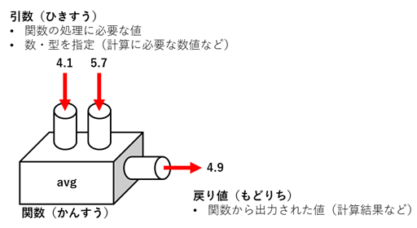
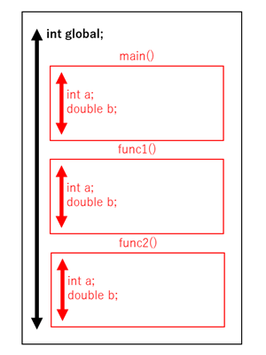

# 概要と目的
- 関数の作り方について学ぶ
- 関数の引数や戻り値に構造体を渡す方法について学ぶ

# 6-1.関数
## (1) 関数とは何か
実用的なソフトウェアを開発しようとすると、プログラムは必然的に長いものになります。するとその中に複雑な処理が現れたり、何度も同じ処理を行ったりすることが必要になります。

C言語ではそういった処理に特別な名前を与え、何度でも再利用したりすることが出来るような仕組みがあります。それを関数（かんすう）と言います。

私たちはすでに`printf`、`scanf`といった関数を利用してきました。これらは通常C言語で標準的に利用可能なものです。C言語ではそれ以外にユーザー自身が自分で関数を作ることができます。そういった関数はユーザー定義関数と言います。

## (2) ユーザー定義関数を作る
ここでは実際にユーザー定義関数を作ってみましょう。てはじめにあるプログラムから重複する処理を関数として定義するという処理を実際にやって見ましょう。まずは、以下のプログラムを見てください。

```c
/* sample1.c */
#include <stdio.h>

int main(void) {
    double d1,d2,d3;
    double a = 1.2,b = 3.4,c = 2.7;
    //	同じ計算が3回
    d1 = (a + b) / 2.0;
    d2 = (4.1 + 5.7) / 2.0;
    d3 = (c + 2.8) / 2.0;
    printf("d1 = %lf,d2 = %lf,d3 = %lf\n",d1,d2,d3);
    return 0;
}
```
```sh
# 実行結果
d1 = 2.300000,d2 = 4.900000,d3 = 2.750000
```

d1,d2,d3は、2つの数値の平均値を求めた値を代入しています。このようなプログラムをかくと、7行目から9行目のように、 同じ処理を複数記述しています。もしも、今後同じような処理を何度も行わなくてはならないとすると、同じ計算処理を繰り返し記述する必要があり非常に面倒です。

そこで、ユーザー定義関数の出番になるわけです。この平均値を求める処理をユーザー定義関数に置き換えて変更したのが以下のプログラムです。

```c
/* sample2.c */
#include <stdio.h>

//	平均値を求める関数の定義
double avg(double m,double n){
    double r = (m + n) / 2.0;
    return r;
}
                                 
int main(void) {
    double d1,d2,d3;
    double a = 1.2,b = 3.4,c = 2.7;
    //	同じ計算が3回(関数を呼び出して計算）
    d1 = avg(a,b);
    d2 = avg(4.1,5.7);
    d3 = avg(c,2.8);
    printf("d1 = %lf,d2 = %lf,d3 = %lf\n",d1,d2,d3);                              
    return 0;
}
```

実行結果は、`sample1.c`と一緒です。ただ、`main()`の中を見てみるとわかると思いますが、先程の平均値の計算処理を行っている個所が、全て、`avg`という文字列に入れ替わっています。 この`avg`が関数であり、`main()`の手前で定義されています。では、一体、この関数はどのような仕組みになっているのでしょうか？

## (3) 関数の仕組み
関数とは複数の入力を受け取り、処理を行い、出力する機能をまとめたものです。



この図では、4.1と5.7という入力を受け取り、平均を取るという処理を行い、4.9という値を出力する関数を表しています。この4.1や5.7のように関数に渡す値を引数と言います。また関数から出力される値を戻り値と言います。

関数を定義するには、関数の名前、引数の型と、処理の内容、戻り値の型を指定する必要があります。書式は以下の通りです。

```c
戻り値の型 関数名（引数の型 引数1,引数の型 引数2,・・・,引数の型 引数n){
    処理
    return 戻り値;
}
```

基本的に関数には、好きな名前を付けることができます。`sample2.c`の場合`avg`という名前をつけています。関数の名付けのルールは変数の場合と似ています。そのため予約語を用いることはできないので注意ましょう。

```c
double avg(double m,double n){
    double r = (m + n) / 2.0;
    return r;
}
```

`sample2.c`のケースでは、double型の変数、`m`と`n`が引数となっています。これらの変数には、関数を呼び出す側が入れた数値が入ります。例えば、15行目では、`avg(4.1,5.7)`としていますので、この場合、`m`に4.1が、`n`に5.7が代入されます。

この値が平均の計算に用いられ、それが`r`に代入され、return（リターン）文によって、呼びだした側（この場合はmain）に返されます。`return r;`とは、「戻り値として、rの値を返しなさい」という意味であり、この結果は、`double`であることから、戻り値の型の部分に`double`と記述してあります。

そして最後に、戻り値は変数`d2`に代入されます。

このようにして定義された関数を呼び出しているのが、`main()`の中の14～16行目です。ここでの戻り値はここで変数`d1`～`d3`に代入されます。

> [!Tip]
> 関数の引数で受け取った値は、全て複製されます。
> そのため関数内で引数の値を変更しても、関数の呼び出し側には影響しません。

## (4) 関数のスコープ
`main()`関数の中で`avg()`関数を使用しています。そのため`avg()`関数は、`main()`関数よりも前に定義されている必要があります。

# 6-2.様々なタイプの関数
## (1) 複数の関数を定義する
関数にはさまざまなタイプがあります。次は様々なタイプの関数をみてみましょう。

```c
/* sample3.c */
#include <stdio.h>

//	2つの整数のうち最大値を求める関数
int max(int a, int b){
	if(a > b){
		return a;
	}
	return b;
}

//	数値を表示する関数
void show(int n){
	printf("数値：%d\n",n);
	return;
}

//  ラインを表示する
void line(void){
	printf("*********\n");
}
 
int main(void) {
   int n1 = 4,n2 = 5;
   line();
   show(n1);
   show(n2);
   printf("二つの数のうち、大きい数は、%dです。\n",max(n1,n2));
   line();
   return 0;
}
```

```sh
# 実行結果
*********
数値：4
数値：5
二つの数のうち、大きい数は、5です。
*********
```

## (2) void
`sample3.c`では、3つの関数が使用されています。

| 関数名 | 戻り値の型 | 引数        | 処理内容                          |
| :----- | :--------- | :---------- | :-------------------------------- |
| max    | int        | int a,int b | 2つの引数a,bのうち最大の値を返す  |
| show   | void       | int n       | 引数で渡された整数の値nを表示する |
| line   | void       | void        | 「*********」を表示               |

`show()`関数と、`line()`関数の戻り値、`line()`関数の引数の部分に書かれている`void(ボイド)`とは、関数の戻り値や引数が無いということを意味しています。

## (2) 関数の途中で処理を終える
次にこれらの関数の戻り値に注目してみましょう。`max()`関数は、if文で引数`a`と`b`の値を比較し、もしも`a`が`b`よりも大きければ途中で「`return a;`」を実行して、途中で関数を終えています。

## (3) 戻り値の省略
また、戻り値の型が「`void`」、つまり戻り値がない場合は「`return`」の後に戻り値を記述する必要がありません。

```c
void show(int n){ ← 戻り値の型が「void」なので引数がない
    printf("数値：%d\n",n);
    return; ← 戻り値がないのでreturnの後に戻り値がない
}
```

また、戻り値がない関数は、`return`を省略することができます。ここでは、`line()`関数で`return`が省略されています。`show()`関数では省略されていませんが、見てもわかるとおり、戻り値にあたるものが記述されていません。

## (4) main関数
ここまでくると、初回から特に説明をせずに使ってきた`main()`の正体がなんとなくわかってきたのではないでしょうか。

`main`もまた関数の一種ですが、C言語でプログラムがここから始まるという特殊な関数です。戻り値は`int`であり、最後に「`return 0;`」で戻り値0を返すルールとなっています。

# 6-3.グローバル変数とローカル変数
## (1) 変数のスコープ
次に、変数のスコープ（有効範囲）について説明しましょう。

```c
/* sample4.c */
#include <stdio.h>
    
//	グローバル変数
int global = 10;

void func1(double a,int b){
    printf("func1処理中\n");
    printf("global=%d\n",global);
    printf("a=%f b=%d\n",a,b);
    printf("******************\n");
}

void func2(){
    double a = -4.1;
    int b = 2;
    printf("func2処理中\n");
    printf("global=%d\n",global);
    printf("a=%f b=%\n",a,b);
}
    
int main(void) {
    double a = 123.41;
    int b = 100;
    printf("main処理中\n");
    printf("global=%d\n",global);
    printf("a=%f b=%d\n",a,b);
    printf("******************\n");
    // func1を呼び出し
    func1(3.1,4);
    // func2を呼び出し
    func2();
    return 0;
}
```

```sh
# 実行結果
main処理中
global=10
a=123.410000 b=100
******************
func1処理中
global=10
a=3.10000 b=4
******************
func2処理中
global=10
a=-4.10000 b=2
******************
```

このプログラムでは、`a`、`b`および`global`という3種類の変数が用いられており、それらの値を`main()`、`func1()`､`func2()`でそれぞれの値を表示しています。

実行結果をみると`global`は全て同じ値である10となっていますが、`a`、`b`の値は各関数の中で値が違います。この違いはそれぞれの変数のスコープの違いに由来するのです。

## (2) ローカル変数とグローバル変数
| 変数の種類     | 概要                   | スコープ                           |
| -------------- | ---------------------- | ---------------------------------- |
| ローカル変数   | `{}`内で定義された変数 | 定義されてから`{}`の終わりまで     |
| グローバル変数 | `{}`外で定義された変数 | 定義されてからファイルの終わりまで |

`a`、`b`という変数はそれぞれ、`main()`、および、`func1()`、`func2()`の範囲内のみで有効なローカル変数です。ローカル変数は、その変数が定義されている関数内のみで有効です。`func1()`のように、関数の引数もこの範疇に入ります。ローカル変数はブロックから抜けた時に廃棄されます。

それに対し、`global`はプログラムの先頭で定義されたグローバル変数と言います。ファイル内のどの関数で呼び出しても同じものを指します。

## (3) 変数のスコープと変数名
ローカル変数は、定義されている関数が違えば、同名のものを定義してもそれぞれ別のものとして扱われます。それに対し、グローバル変数の場合は、プログラム全体でただ一つしかありません。したがって、名前の重複は許されません。



# 6-4.関数の応用
さて、これまでは関数の引数や戻り値にint型やdouble型を扱ってきまし。ここでは引数や戻り値に配列や構造体を扱う方法を紹介します。

## (1) 配列を深く学ぶ
まずは配列をより深く学習します。配列とは同じデータ型のデータを複数扱う方法でした。`int a[5]`とすれば、int型の変数を5個用意することができました。ここで注意したいのは`a`という配列自身は自分がどれぐらいの大きさの配列かを把握していないということです。つまり以下のようなプログラムでもコンパイラはエラーを出力しません。(優秀なコンパイラは警告を出してくれるかもしれません)

```c
#include <stdio.h>

int main(void){
    int a[5];
    a[10] = 1; // 配列aは5個の変数しか持たないのに11個目にアクセスしている
    return 0;
}
```

コンパイラエラーが出ないのは、文法的には正しいからです。ただ動作は未定義であり、どのような結果になるかは分かりません。

このように配列自身は、配列のサイズを把握しておらず、プログラマが管理する必要があります。

## (2) 関数で配列を扱う
では関数で配列を扱う方法を説明します。以下のサンプルプログラムを実行してみましょう。

```c
/* sample5.c */
#include <stdio.h>

// 最大値を求める関数
int max(int x[], int size){
    int max=x[0];

    for(int i=0; i<size; i++){
        if(max < x[i]){
            max = x[i];
        }
    }

    return max;
}

int main(void){
    int a[5] = {2, 3, 1, 6, 1};
    int b[7] = {2, 8, 3, 1, 9, 6, 1};
    printf("aの最大値は %d\n", max(a, 5));
    printf("bの最大値は %d\n", max(b, 5));
    return 0;
}
```

```sh
# 実行結果
aの最大値は 6
bの最大値は 9
```

引数に配列を使う場合は添え字の部分を省略して、配列だと分かるようにします。配列のサイズはプログラマが責任を持って管理する必要があるので、引数で配列の個数を受け取っています。

## (3) 関数で構造体を扱う
関数の引数に構造体を指定する場合は、int型やdouble型を指定するようにすることでできます。

```c
void func(person_t x){
    // 処理;
    return;
}
```

例では`person_t`の構造体を引数として受け取っています。

